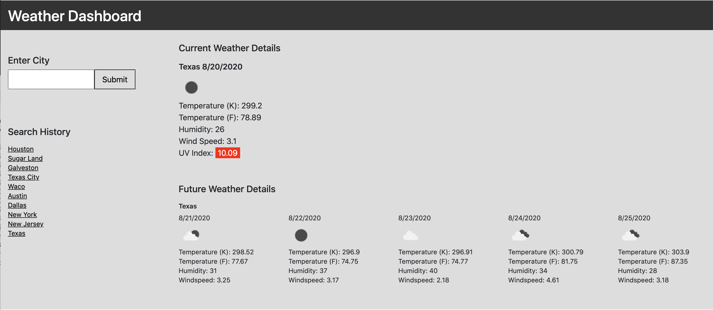

# 06 Server-Side APIs: Weather Dashboard

This weather dashboard retrieves data from another application's API and uses it to display weather data by accessing their data and functionality by making requests with specific parameters to a URL. The final application runs in the browser and feature dynamically updated HTML and CSS.

The third party API named, [OpenWeather API](https://openweathermap.org/api) was used to retrieve weather data for cities.

View Website: https://jennifoo.github.io/06-server-side-apis-weather-dashboard/
Github Repository: https://github.com/jennifoo/06-server-side-apis-weather-dashboard



## User Story

```
AS A traveler
I WANT to see the weather outlook for multiple cities
SO THAT I can plan a trip accordingly
```

## Acceptance Criteria

```
GIVEN a weather dashboard with form inputs
WHEN I search for a city
THEN I am presented with current and future conditions for that city and that city is added to the search history
WHEN I view current weather conditions for that city
THEN I am presented with the city name, the date, an icon representation of weather conditions, the temperature, the humidity, the wind speed, and the UV index
WHEN I view the UV index
THEN I am presented with a color that indicates whether the conditions are favorable, moderate, or severe
WHEN I view future weather conditions for that city
THEN I am presented with a 5-day forecast that displays the date, an icon representation of weather conditions, the temperature, and the humidity
WHEN I click on a city in the search history
THEN I am again presented with current and future conditions for that city
WHEN I open the weather dashboard
THEN I am presented with the last searched city forecast
```
